[](https://classroom.github.com/a/YyUO0xtt)
# COMP2150  - Level Design Document
### Name: [Samuel Hicks]
### Student number: [47434740] 

This document discusses and reflects on the design of your platformer level for the Level Design assessment. It should be 1500 words. Make sure you delete this and all other instructional text throughout the document before checking your word count prior to submission. Hint: You can check word count by copying this text into a Word or Google doc.

Your document must include images. To insert an image into your documentation, place it in the "DocImages" folder in this repo, then place the below text where you want the image to appear:

```

```

Example:


## 1. Player Experience (~700 words)
Outline and justify how your level design facilitates the core player experience goals outlined in the assignment spec. Each section should be supported by specific examples and screenshots of your game encounters that highlight design choices made to facilitate that particular experience.

### 1.1. Discovery

My level design facilitates learning through a combination of visual cues, environmental storytelling, and gradual introduction of mechanics. Players begin in an underground cave area with an alien statue and a platform guiding them along the initial path. This visually distinct section introduces basic platforming mechanics like jumping and running. On top of the opening sits pink spikes and a moving platform moving through the opening leading players to try new things. This reinforces learning through a non-intrusive method.

As players progress, the environment transitions to another cave setting. Here players encounter their first enemy as well as a weapon pickup totem and a health recovery which act as the introduction of the weapons tutorial allowing them to test their new items on an enemy.

Players have to then figure out a small simple puzzle as there is a small platform of green grass leading their attention and giving direction without explicitly telling them where to go. After getting up from the small platforming puzzle they reach a new above ground area encouraging players to explore as well and fight some more enemies putting their skills together. As well as discovering a pool of Acid, environmental storytelling in the form of a closed alien door and alien block. There is a moving switch where players have to time their movement to open it and then if they pass through the door they will realize they cannot make the jump yet leading them to go back and push a block from a higher platform down into the acid to make it across.

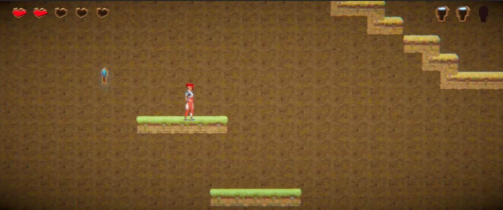

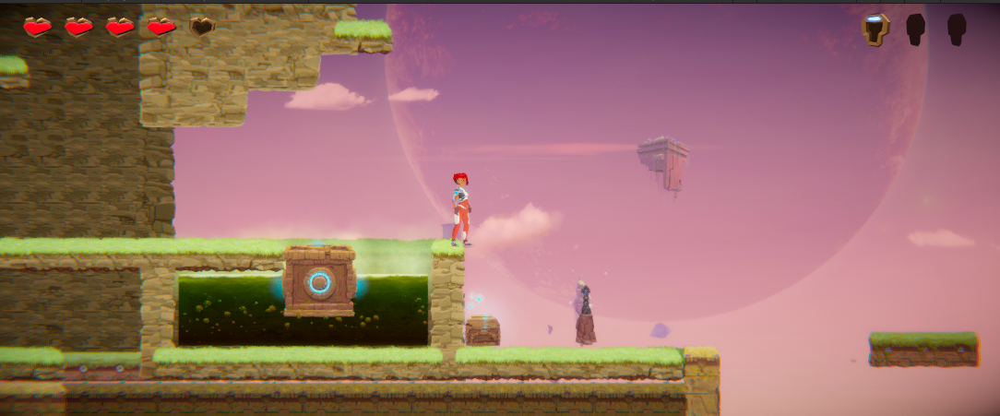

### 1.2. Drama

My level's Drama intensity curve starts low in the underground cave with a focus on exploration and basic platforming. As players enter the extended underground, the enemy encounters become more frequent. Initially, players face slow-moving chompers that telegraph their attacks clearly. This allows players to learn enemy attack patterns and practice basic combat mechanics.

The intensity increases as players explore the level further. The frequency of enemy encounters rises, and faster, more agile enemies like spitters are introduced. Environmental hazards like spike traps are strategically placed to force players into quick decisions and test their platforming skills under pressure. However, moments of relief are interwoven throughout. Health pickups and checkpoints, providing opportunities to recover and strategize before continuing.

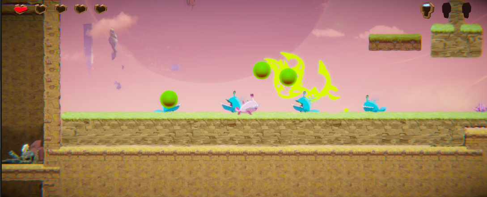

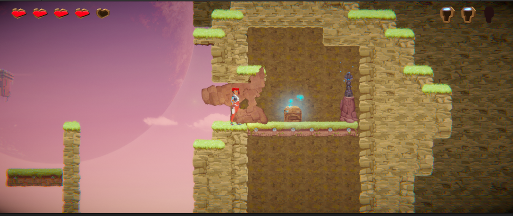

### 1.3. Challenge

The main challenges players face are platforming navigation, enemy combat, and overcoming environmental hazards. The level is designed with a balanced difficulty curve introducing new mechanics alongside forgiving environments for practice. For example, the initial jump sections are generous in terms of platform spacing, allowing players to master basic jumping. As the level progresses platforms become narrower and require more precise jumps.

Challenging enemy encounters are interspersed with platforming sections, forcing players to switch between skill sets. Early enemy encounters allow players to learn basic combat mechanics. Later enemies' numbers increase, requiring the use of dodging and jumping combined with combat to defeat them. To encourage exploration, keys are given after a challenge is achieved to reward players for their efforts.

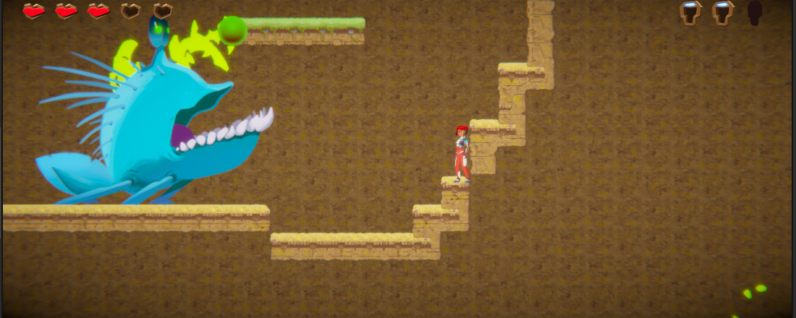

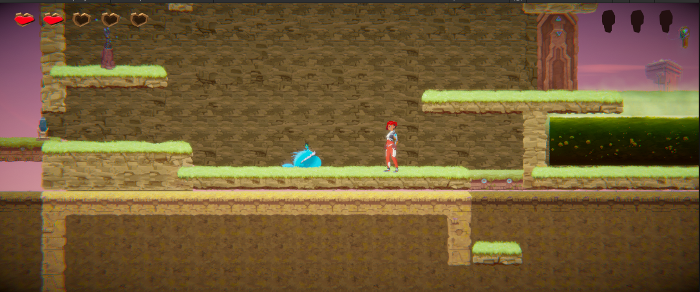

### 1.4. Exploration

The level design encourages exploration through a combination of blocked areas, collectible items, and visually distinct landmarks. These rewards entice players to seek out hidden areas and experiment with the environment. Additionally, collectible items like keys are scattered throughout the level. These keys are integral to the gameplay as they progress the in-game narrative but also are necessary for players to finish the level offering a sense of gradual completion and encourage players to thoroughly explore every nook and cranny.

The level is divided into three distinct sections:The beginning cave. Puzzle plains and a final big boss chamber. Each section possesses a unique visual aesthetic, distinct color palettes,  background elements and architecture. Underground sections have a lighter coloured dirt to them with dead grass and green grass areas represent the above ground sections  This creates memorable landmarks that players can use to orient themselves and guide their exploration.

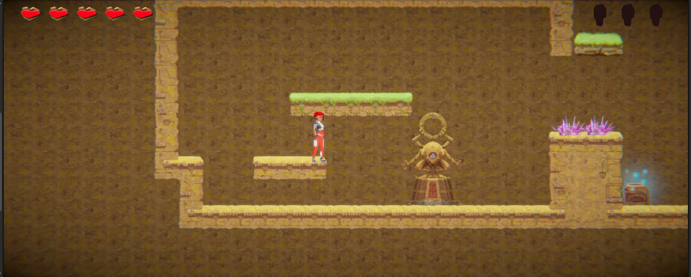

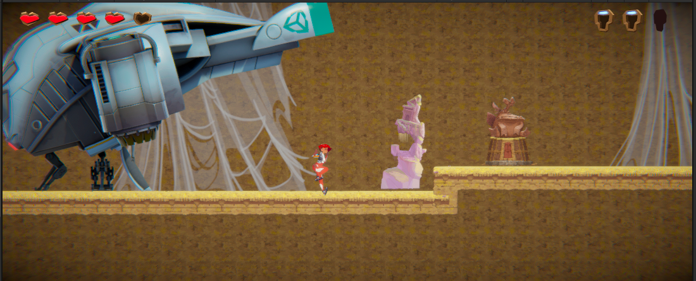

## 2. Core Gameplay (~400 words)
A section on Core Gameplay, where storyboards are used to outline how you introduce the player to each of the required gameplay elements in the first section of the game. Storyboards should follow the format provided in lectures.

Storyboards can be combined when multiple mechanics are introduced within a single encounter. Each section should include a sentence or two to briefly justify why you chose to introduce the mechanic/s to the player in that sequence.

You should restructure the headings below to match the order they appear in your level.

### 2.1. Moving Platforms
Moving platforms are introduced almost immediately in my level being first seen in the first room. Moving platforms are initially placed strategically to teach players the minimal level of skill required to complete the level. As my level progresses the timings and placement change increasing the difficulty.

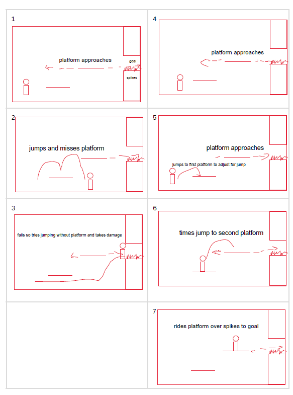

### 2.2. Checkpoints
My level introduces checkpoints reletively quickly being near my first enemy so that when players actually do die they can quickly respawn and try again. My checkpoints are placed strategically before areas of big challenge to reduce frustration in players.

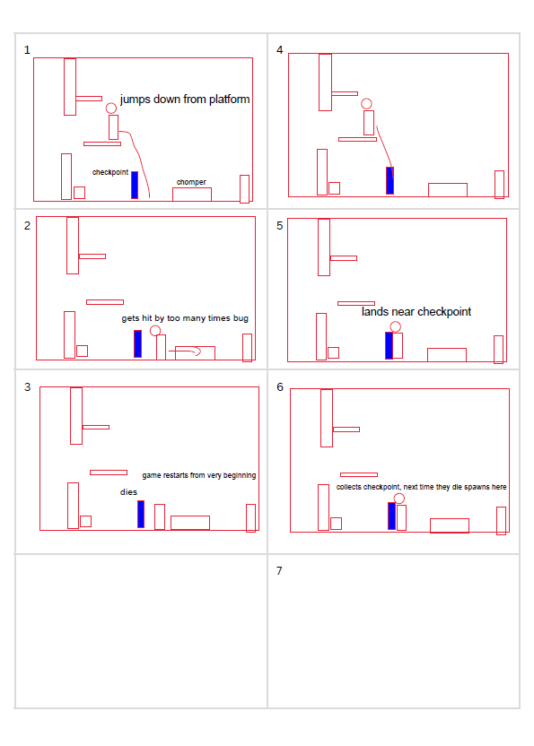

### 2.3. Chompers
Chompers are the first enemy players encounter in my level as they have reletively simple attack patterns not giving players much challenge at the beginning but when paired with spitters can become more challenging

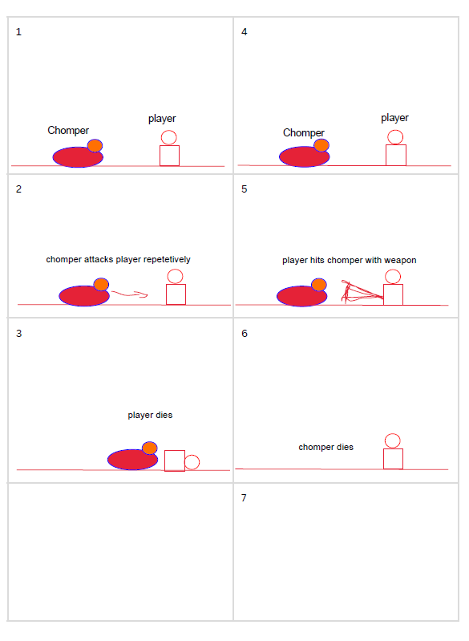

### 2.4. Health Pickups
Health Pickups are an optional choice for the player and cannot be picked up unless the player has sustained at least 1 heart of damage and can only be used to recover 1 heart of damage

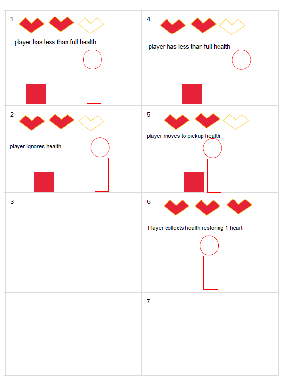

### 2.5. Acid
Acid is a damaging liquid that does can kill players but it is also a useful tool that I have used to create a situation where players have to think to find a way around it.

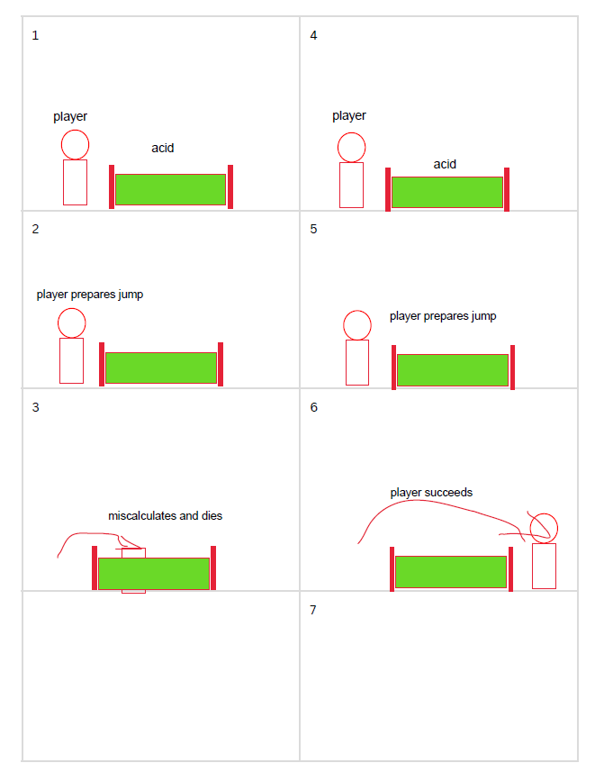

### 2.6. Keys
Keys are an essential item that must be collected in order to complete the level. But they also lead players through the level without directly telling them where to go.

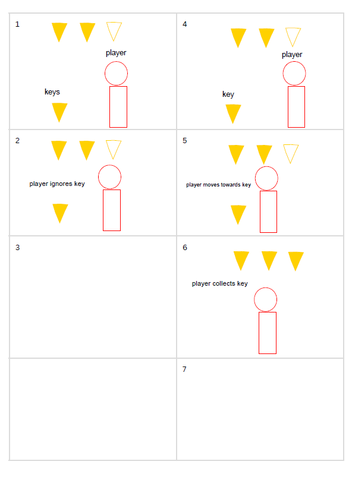

### 2.7. Passthrough Platforms
Passthrough Platforms are used to create seperation between enviroments they help to add drama to the games atmosphere as players wonder what is below or above.

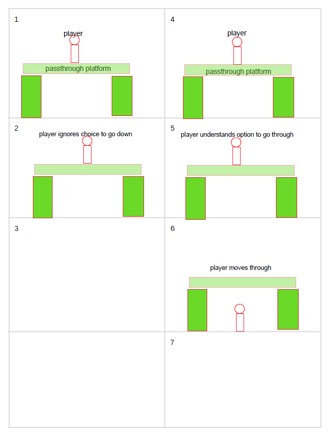

### 2.8. Spikes
Spikes are a dangerous object that damages the player posing as a obsticle for players to use skill to avoid. They also add to the tension when there are other enemies around.

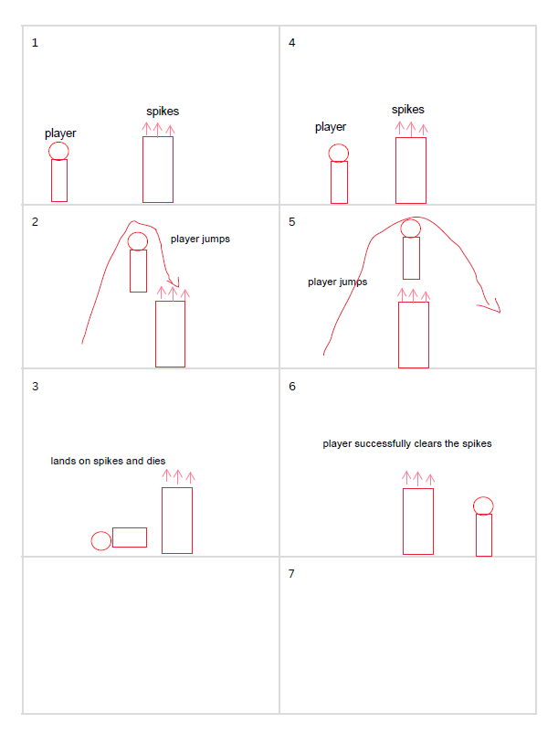

### 2.9. Spitters
Spitters are an enemy that use a long range projectile as their main damaging attack. In my game I have sized up the size of the spit balls that they shoot to add to the challenge they are a great tool to add difficulty to a situation.

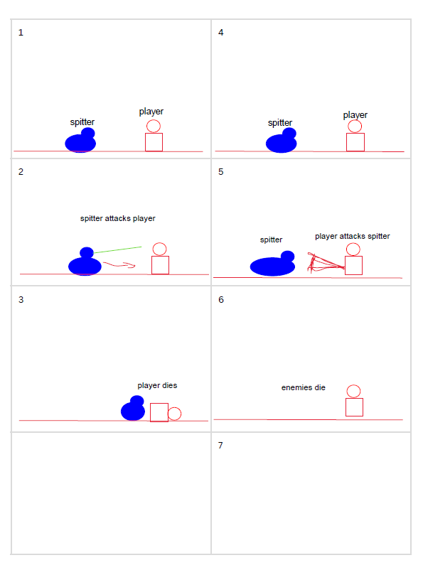

### 2.10. Weapon Pickup (Gun)
The Gun weapon is the players long range attack and travels in a linear movement. My level doesnt specifically utilise the gun shooting mechanic but players can shoot enemies from a distance to reduce the chance of taking damage.

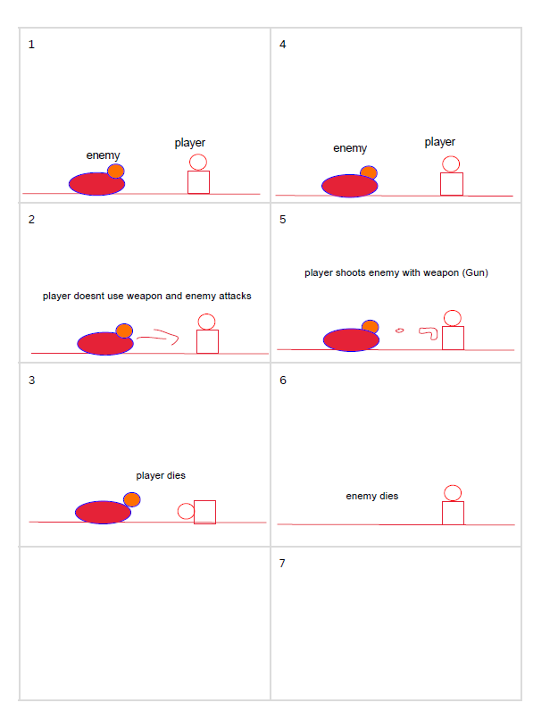

### 2.11. Weapon Pickup (Staff)
The Staff weapon is the players short range attack and travels in a close swinging movement. My level utilises the staff mechanic as players can kill enemies from close up as it is faster than shooting.

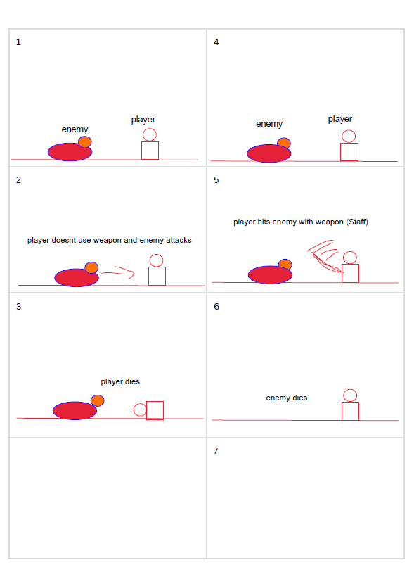

## 3. Spatiotemporal Design
A section on Spatiotemporal Design, which includes your molecule diagram and annotated level maps (one for each main section of your level). These diagrams may be made digitally or by hand, but must not be created from screenshots of your game. The annotated level maps should show the structure you intend to build, included game elements, and the path the player is expected to take through the level. Examples of these diagrams are included in the level design lectures.
 
### 3.1. Molecule Diagram

### 3.2. Level Map – Section 1

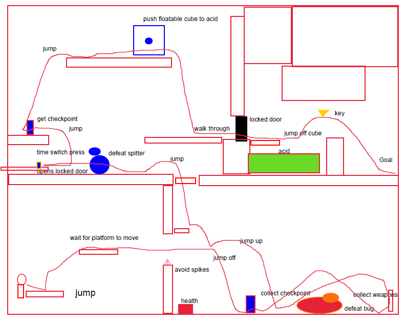

### 3.3.	Level Map – Section 2

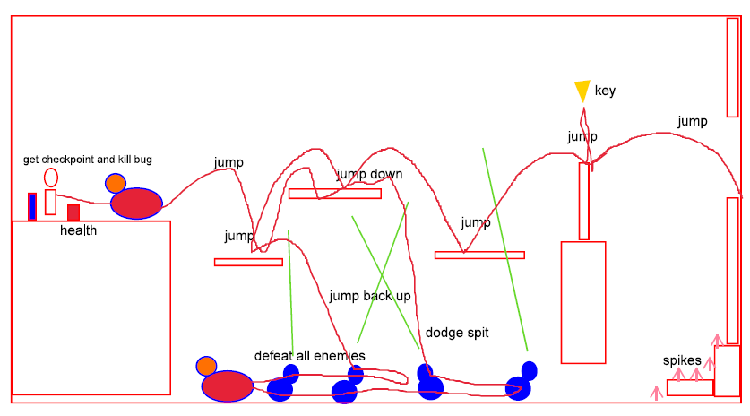

### 3.4.	Level Map – Section 3

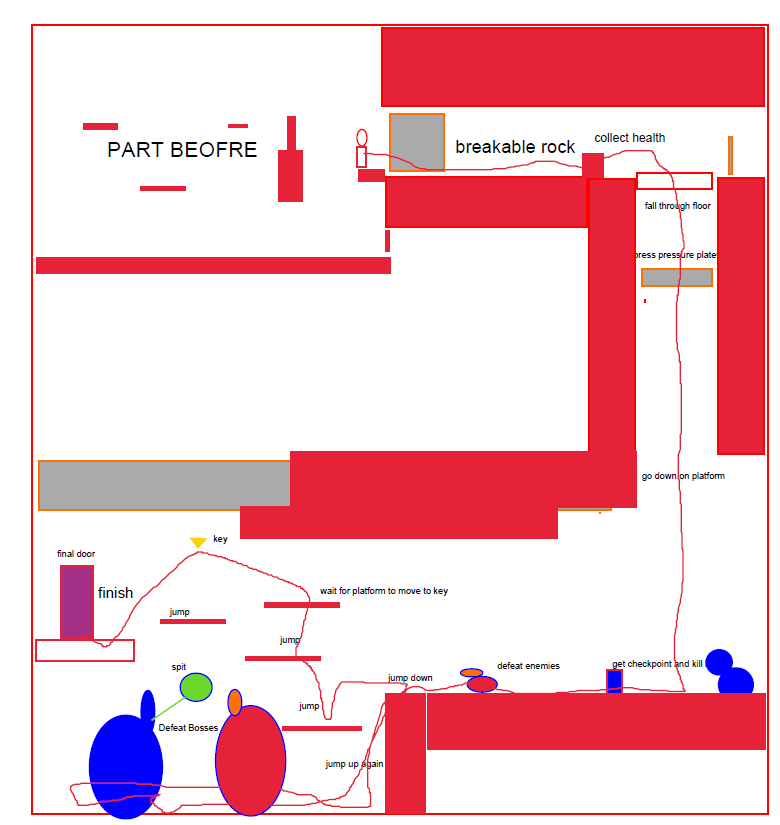

## 4. Iterative Design (~400 words)
Reflect on how iterative design helped to improve your level. Additional prototypes and design artefacts should be included to demonstrate that you followed an iterative design process (e.g. pictures of paper prototypes, early grey-boxed maps, additional storyboards of later gameplay sequences, etc.). You can also use this section to justify design changes made in Unity after you drew your level design maps shown in section 3. 

You should conclude by highlighting a specific example of an encounter, or another aspect of your level design, that could be improved through further iterative design.


## Generative AI Use Acknowledgement

Use the below table to indicate any Generative AI or writing assistance tools used in creating your document. Please be honest and thorough in your reporting, as this will allow us to give you the marks you have earnt. Place any drafts or other evidence inside this repository. This form and related evidence do not count to your word count.
An example has been included. Please replace this with any actual tools, and add more as necessary.


### Tool Used: ChatGPT
**Nature of Use** Finding relevant design theory.

**Evidence Attached?** Screenshot of ChatGPT conversation included in the folder "GenAI" in this repo.

**Additional Notes:** I used ChatGPT to try and find some more relevant design theory that I could apply to my game. After googling them, however, I found most of them were inaccurate, and some didn't exist. One theory mentioned, however, was useful, and I've incorporated it into my work.

### Tool Used: Example
**Nature of Use** Example Text

**Evidence Attached?** Example Text

**Additional Notes:** Example Text


